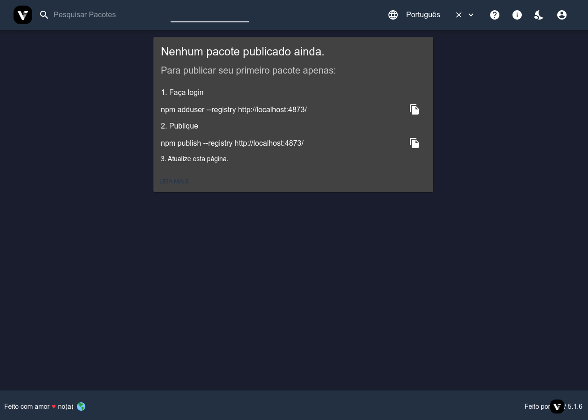
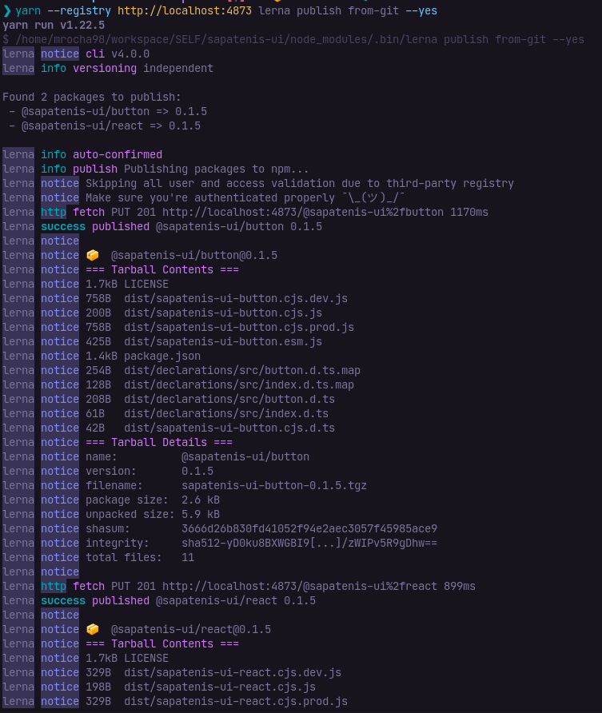
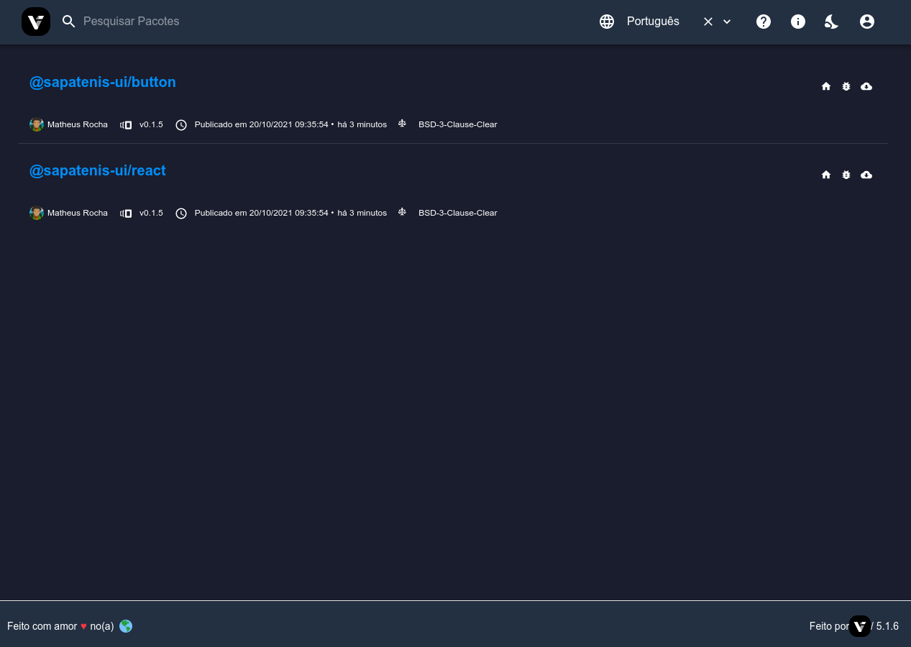

# Sapatênis UI

[](https://lerna.js.org/)
[](https://github.com/mrocha98/sapatenis-ui/blob/main/LICENSE)

React components

## Verdaccio setup

É possível utilizar o verdaccio como um pacote npm global ou via docker.

pacote global:

```sh
npm i -g verdaccio
verdaccio
```

docker:

```sh
docker run \
-d \
-it \
--rm \
--name verdaccio \
-p 4873:4873 \
verdaccio/verdaccio:5
docker logs -f --tail 10 verdaccio
```

Crie um usuário fornecendo um nickname, senha e email:

```sh
npm adduser --registry http://localhost:4873/
```

Tudo pronto. Acesse a url `http://localhost:4873/` no seu navegador para ter um feedback visual quando publicar os pacotes.



## Publicando os pacotes

Verifique se há necessidade de gerar uma nova tag executando:

```sh
yarn release
```

E então publique no verdaccio:

```sh
yarn --registry http://localhost:4873 lerna publish from-git
```





**IMPORTANTE:** não é possível públicar pacotes se houver mudanças não commitadas!
Caso ocorra algum erro durante o processo, pode ser que o lerna tenha adicionado o campo `gitHead` nos `package.json`s, apague esses campos.

## Instalando os pacotes

Para instalar os pacotes em outras aplicações é necessário que o verdaccio esteja rodando e sua url seja exposta no parâmetro `--registry`:

```sh
yarn add --registry http://localhost:4873 @sapatenis-ui/react
```

Pacotes publicados no npm podem ser instalados normalmente:

```sh
yarn add --registry http://localhost:4873 lodash
```

É possível omitir o `--registry` configurando a url diretamente no arquivo `.npmrc` do seu usuário local:

```sh
npm set registry http://localhost:4873/
```

Como essa configuração é em nível global, atente-se que pode afetar suas instalações em outros projetos que não utilizam o verdaccio ou quando ele estiver desligado.

Para reverter ao valor padrão:

```sh
npm set registry https://registry.npmjs.org/
```
